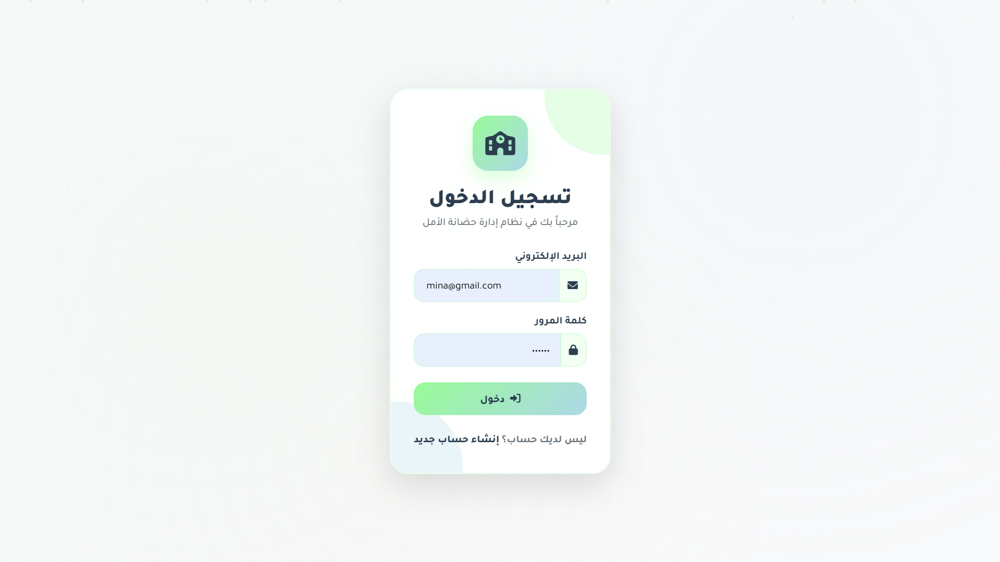
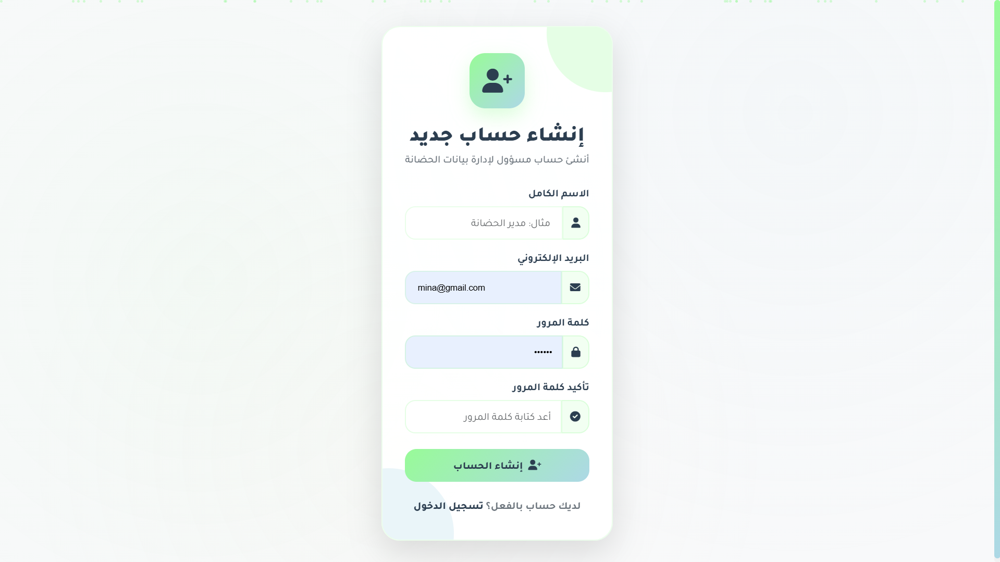
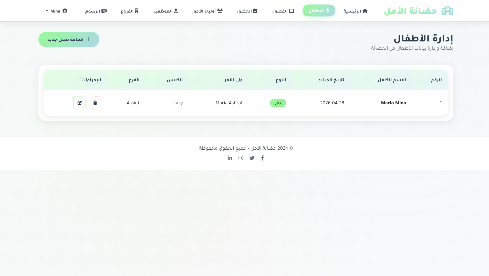
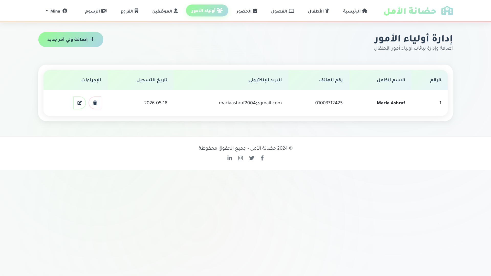
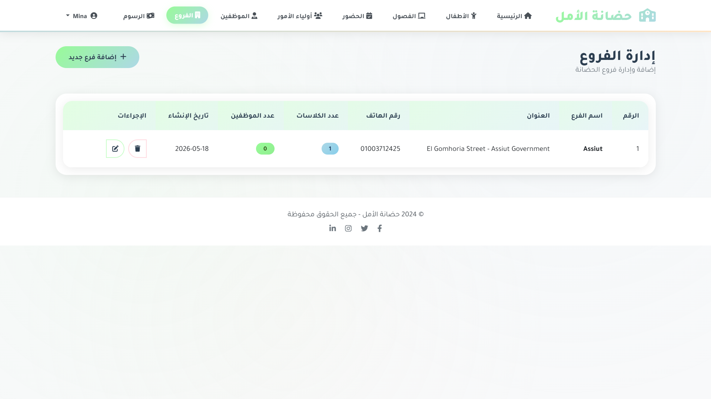
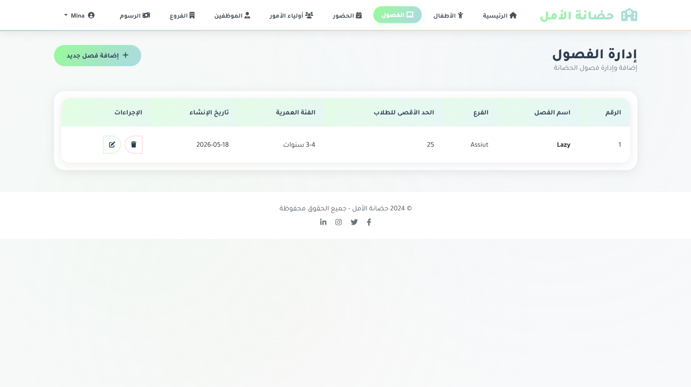
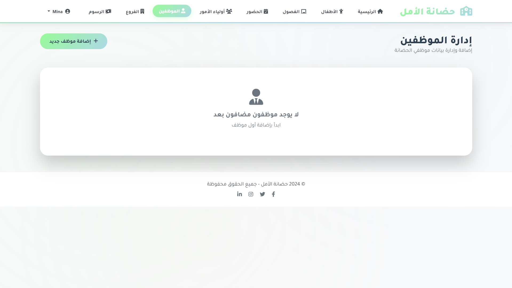
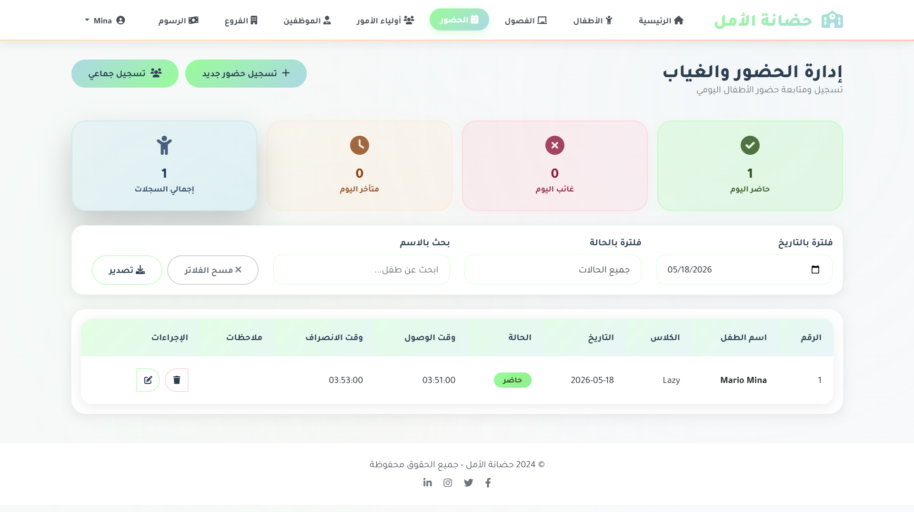
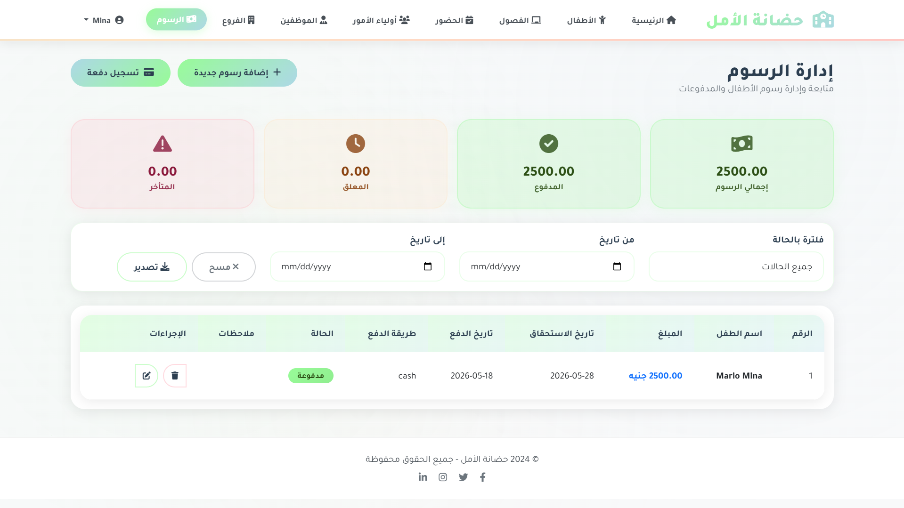

# Kindergarten Management System - Flask Web Application

Kindergarten Management System is a full-stack nursery management web application built using **Flask**, **MySQL**, and **SQLAlchemy**.

The system helps nursery administrators manage daily operations such as children records, parents, classes, branches, staff members, attendance tracking, and fee payments through a clean and user-friendly dashboard.

---

## Project Preview

The application starts with a secure authentication system where users can create an account and login before accessing the system.



After logging in, the user is redirected to a dashboard that displays an overview of the nursery activity and important statistics.


---

## Project Overview

This project simulates a real nursery management system designed for one kindergarten organization.

The system allows authorized users to manage the main nursery data from one place.  
It includes authentication, CRUD operations, database relationships, attendance management, and payment tracking.

The application was originally refactored from a SQLite-based project and upgraded to use **MySQL with Flask-SQLAlchemy** for a cleaner and more scalable database structure.

---

## Technologies Used

- Python
- Flask
- Flask-SQLAlchemy
- Flask-Migrate
- MySQL
- PyMySQL
- SQLAlchemy ORM
- Jinja2 Templates
- HTML
- CSS
- Bootstrap RTL
- JavaScript
- Font Awesome
- python-dotenv
- Werkzeug Security

---

## Main Features

## 1. Authentication System

The system includes a complete authentication flow.

Users can:

- Create a new account
- Login using email and password
- Logout securely
- Access protected pages only after login

Passwords are stored securely using password hashing with Werkzeug.



---

## 2. Admin Dashboard

The dashboard provides a quick overview of the nursery system.


The dashboard displays statistics such as:

- Number of branches
- Number of classes
- Number of children
- Number of parents
- Number of staff members
- Today attendance records
- Number of fee records

This helps the admin monitor the nursery activity from one central page.

---

## 3. Children Management

The children page allows the admin to manage children records.



The admin can:

- Add a new child
- Edit child information
- Delete a child logically
- Assign a child to a parent
- Assign a child to a class
- View child gender, birth date, class, branch, and parent information

This feature connects children with parents, classes, and branches.

---

## 4. Parents Management

The parents page allows the admin to manage parents and guardians.



The admin can:

- Add a new parent
- Edit parent data
- Delete a parent if not linked to children
- Store contact information such as phone, email, and address

Parents are linked to children through a database relationship.

---

## 5. Branches Management

The branches page allows the admin to manage nursery branches.



The admin can:

- Add a new branch
- Edit branch details
- Delete a branch if it is not linked to classes or staff
- View the number of classes and staff members in each branch

Branches are connected to classes and staff members.

---

## 6. Classes Management

The classes page allows the admin to manage nursery classes.



The admin can:

- Add a new class
- Assign a class to a branch
- Set maximum capacity
- Define age group
- Edit class information
- Delete a class if it has no assigned children

Classes are linked to children and branches.

---

## 7. Staff Management

The staff page allows the admin to manage nursery employees.



The admin can:

- Add a new staff member
- Edit staff data
- Delete staff records
- Store position, phone, email, salary, and hire date
- Assign staff members to branches

This helps manage the nursery team in an organized way.

---

## 8. Attendance Management

The attendance page allows the admin to record and track children attendance.



The admin can:

- Add attendance records
- Register attendance status
- Track present, absent, and late children
- Add check-in and check-out time
- Add notes
- Update attendance records
- Delete attendance records
- Use bulk attendance registration

Attendance records are linked to children.

---

## 9. Fees Management

The fees page allows the admin to manage nursery payments.



The admin can:

- Add fee records
- Track paid, pending, and overdue fees
- Register payment date
- Select payment method
- Update fee records
- Delete fee records
- Process multiple payments

Fee records are linked to children.

---

## Project Architecture

The project follows a clean Flask structure with separation between application configuration, models, routes, templates, static files, and database migrations.

```text
Kindergarten-Management-System
│
├── app.py
├── extensions.py
├── models.py
├── requirements.txt
├── README.md
├── .gitignore
├── .env.example
│
├── routers
│   ├── __init__.py
│   ├── auth.py
│   ├── routersattendance.py
│   ├── routersbranch.py
│   ├── routerschild.py
│   ├── routersclasses.py
│   ├── routersfee.py
│   ├── routersparent.py
│   └── routersstaff.py
│
├── templates
│   ├── base.html
│   ├── index.html
│   ├── parent.html
│   ├── child.html
│   ├── branch.html
│   ├── class.html
│   ├── staff.html
│   ├── attendance.html
│   ├── fees.html
│   │
│   └── auth
│       ├── login.html
│       └── signup.html
│
├── static
│   ├── css
│   │   └── style.css
│   │
│   └── js
│       └── script.js
│
├── migrations
│
└── screenshots
    ├── login.png
    ├── signup.png
    ├── dashboard.png
    ├── children.png
    ├── parents.png
    ├── branches.png
    ├── classes.png
    ├── staff.png
    ├── attendance.png
    └── fees.png